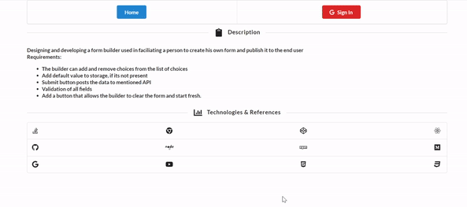

# Form-Builder-React-Redux-ReduxForms.
## This is designed for a "builder". A "builder" is a user of the product that creates forms. 
## the problem statement given was [link here ](https://github.com/QuickBase/interview-demos/tree/master/ui)
### Redux has been implemented to avoid props drilling. The data is made availble across all components by making single source of data at redux store

### The builder has to login , google oAuth2 was intergrated
### The builder can add and remove choices from the list of choices.
### the form is responsive and work on mobile devices in addition to desktop.
### if a user enters the word that is longer than 40 characters, the characters above 40 would be highlighted in red
### Modal is implemented for preview with highest z-index
### The data is persisted if user accidentally closes the browser, redux-persist library is used to achieve this
### Delete button is mapped to every choice added, The choice can be deleted with help of the delete icon

